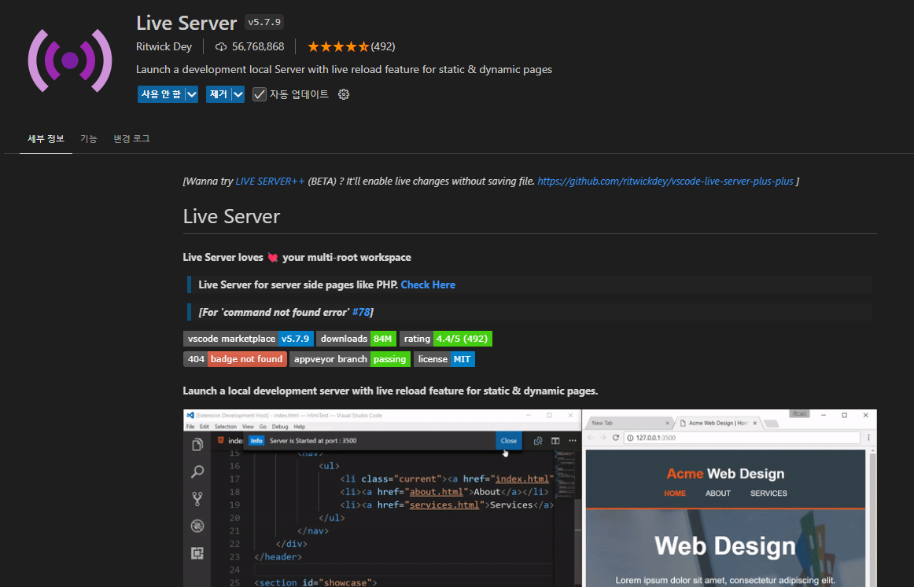
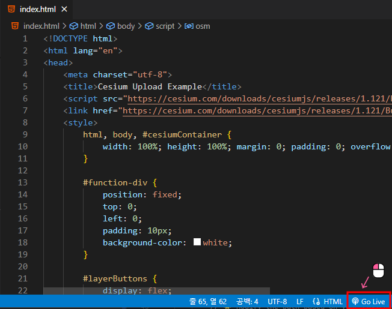
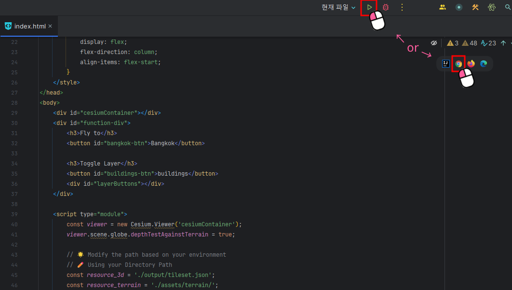

# mago3D 데이터 가공 가이드

# :bookmark_tabs: 사용할 데이터 전처리

실습에 앞서 이번 챕터에서는 사용하게 될 Mago3D와 GeoServer에서 데이터를 활용하기 위해 필요한 데이터 가공 및 변환 작업을 진행합니다.   
이러한 도구들은 도시 디지털 트윈을 구현하고 시각화하는 데 강력한 기능을 제공하지만, 각 도구의 특성과 요구사항에 맞는 데이터 형식으로 변환이 필요합니다.   
진행할 데이터 변환 작업을 표로 정리하면 다음과 같습니다.

| 원본 파일명 |  변환 전   |    변환 후    |                    변환 이유                     |  
|:---:|:-------:|:----------:|:--------------------------------------------:|
|khlongtoei_building.geojson| GeoJSON |  3DTiles   |      osgeo 표준에 맞춰 Mago3D에 원활히 렌더링하기 위해       |
|khlongtoei_transportation.geojson| GeoJSON | Geopackage |       GeoServer에서의 관리 및 배포 효율성을 높이기 위해       |
|T47PPR_20240430T033541_TCI_10m.jp2|   JP2   |  GeoTiff   | 위성 이미지를 GeoServer에서 분석과 배포가 용이한 형식으로 변환하기 위해 |

이제 실습 준비가 완료되었습니다. 다음 단계를 진행하세요! 🚀

---

## 1. Overture Maps 데이터 가공

파이썬 가상 환경에서 받은 GeoJSON 데이터의 전처리가 필요합니다.   
- 가상환경을 설정했던 `C:\mago3d` 경로에 받아진 GeoJSON 파일을 모두 `C:\mago3d\workspace` 파일로 옮겨줍니다.

### 1. khlongtoei_building.geojson

mago3d-tiler를 돌려 3DTiles로 변환할 파일입니다.
해당 GeoJSON 파일에는 높이 값이 없는 건물들이 포함되어 있으므로 건물의 높이 값을 추출하여 가공합니다.

- khlongtoei_building.geojson 파일을 복사하여 khlongtoei_building_origin.geojson 파일을 만들어줍니다.
- khlongtoei_building_origin.geojson 파일에서 건물 높이를 추출합니다.
    ```sql
    $ docker run --rm -v C:\mago3d\workspace:/data ghcr.io/osgeo/gdal:ubuntu-full-3.9.0 ogr2ogr -f "GeoJSON" /data/khlongtoei_hegiht.geojson /data/khlongtoei_building_origin.geojson -sql "SELECT height FROM khlongtoei_building_origin WHERE height IS NOT NULL"
    ```
- khlongtoei_building_origin.geojson 파일에서 건물 층수를 높이 값으로 변환합니다.
    ```sql
    $ docker run --rm -v C:\mago3d\workspace:/data ghcr.io/osgeo/gdal:ubuntu-full-3.9.0 ogr2ogr -f "GeoJSON" /data/khlongtoei_num_floors.geojson /data/khlongtoei_building_origin.geojson -sql "SELECT num_floors * 3.3 AS height FROM khlongtoei_building_origin WHERE height IS NULL"
    ```
- 추출한 건물 높이와 건물 층수 높이를 khlongtoei_building.geojson 파일에 병합합니다.
    ```sql 
    $ docker run --rm -v C:\mago3d\workspace:/data ghcr.io/osgeo/gdal:ubuntu-full-3.9.0 ogr2ogr -f "GeoJSON" /data/khlongtoei_building.geojson /data/khlongtoei_hegiht.geojson
    $ docker run --rm -v C:\mago3d\workspace:/data ghcr.io/osgeo/gdal:ubuntu-full-3.9.0 ogr2ogr -f "GeoJSON" -append /data/khlongtoei_building.geojson /data/khlongtoei_num_floors.geojson
    ```
- `C:\mago3d\workspace` 경로에 input 폴더를 생성하여 병합이 완료된 khlongtoei_building.geojson 파일을 넣어줍니다.

### 2. khlongtoei_transportation.geojson

geosever에 레이어로 올리기 위해 Geopackage 파일로 변환할 파일입니다.

  ```sql
  $ docker run --rm -v C:\mago3d\workspace:/data ghcr.io/osgeo/gdal:ubuntu-full-3.9.0 ogr2ogr -f "GPKG" /data/khlongtoei_transportation.gpkg /data/khlongtoei_transportation.geojson
  ```
- `C:\mago3d\workspace\geoserver` 경로에 data 폴더를 생성하여 변환해준 gpkg 파일을 넣어줍니다.

---

## 2. Copernicus Data Space Ecosystem 데이터 가공

geoserver에 레이어로 올리기 위해 GeoTIff 파일로 변환할 파일입니다.

- 다운로드 경로에 받아진 SAFE.zip 파일의 압축을 해제합니다.
- GRANULE\L2A_T47PPR_A046247_20240430T034959\IMG_DATA\R10m 경로에 있는 T47PPR_20240430T033541_TCI_10m.jp2 파일을 `C:\mago3d\workspace` 폴더로 옮겨줍니다.
- jp2 파일을 tif 파일로 변환합니다.
    ```sql
    $ docker run --rm -v C:\mago3d\workspace:/data ghcr.io/osgeo/gdal:ubuntu-full-3.9.0 gdal_translate -of GTiff /data/T47PPR_20240430T033541_TCI_10m.jp2 /data/T47PPR_20240430T033541_TCI_10m.tif
    ```
- `C:\mago3d\workspace\geoserver\data` 경로에 변환해준 tif 파일을 넣어줍니다.

---

## 3. NASA DEM 데이터 가공

mago3d-terrainer를 통해 terrain 정보로 변환할 파일이며, mago3d-tiler를 실행할 때도 사용됩니다.

- 다운로드 경로에 받아진 ASTGTM_003-20241118_054943 폴더를 열어 ASTGTMV003_N13E100_dem.tif 파일을 복사해줍니다.
- `C:\mago3d\workspace\input` 경로에 복사해준 파일을 붙여넣습니다.
- `C:\mago3d\workspace` 경로에 dem 폴더를 생성하여 복사해준 파일을 붙여넣습니다.

---

이제 데이터 가공이 모두 완료되었습니다. 다음 단계를 진행하세요! 🚀

---

# 🌟 MAGO3D 사용 가이드

- `C:\mago3d\workspace` 경로의 input과 dem의 폴더 안에 데이터가 잘 들어가있는 지 확인합니다.
    - input> khlongtoei_building.geojson, ASTGTMV003_N13E100_dem.tif
    - dem> ASTGTMV003_N13E100_dem.tif
  
## MAGO3D-TILER

- 건물의 기본 높이 값을 3.3m로 지정하여 mago3d-tiler를 돌립니다.

### Windows

```sql
$ docker run ^
  --rm ^
  -v C:\mago3d\workspace:/workspace gaia3d/mago-3d-tiler ^
  -input /workspace/input ^
  -output /workspace/output ^
  -it geojson ^
  -crs 4326 ^
  -te /workspace/dem/ASTGTMV003_N13E100_dem.tif ^
  -mh 3.3 ^
  -hc height
```

### Mac / Linux

```sql
$ docker run \
  --rm \
  -v C:/mago3d/workspace:/workspace gaia3d/mago-3d-tiler \
  -input /workspace/input \
  -output /workspace/output \
  -it geojson \
  -crs 4326 \
  -te /workspace/dem/ASTGTMV003_N13E100_dem.tif \
  -mh 3.3 \
  -hc height
```
  
---

### 실행 명령어 설명

`$ docker run gaia3d/mago-3d-tiler --help`을 입력하시면 모든 명령어 옵션을 확인할 수 있습니다.

> - `--rm`: 컨테이너 실행 후 자동 삭제
> - `-v`: 데이터 디렉토리 볼륨 마운트  
>   - `C:\mago3d\workspace` 경로를 mago3d-tiler의 data_dir로 마운트하여 데이터를 연결합니다.
> - `-input`: 변환 전 자료를 담고 있는 경로
> - `-output`: 변환 후 자료를 담아 줄 경로
> - `-it`: 변환 전 자료의 자료형
> - `-crs`: 변환 전 자료의 EPSG 좌표 체계
> - `-te`: 변환 시 사용할 GeoTiff 형식의 Terrain 파일 경로
> - `-mh`: 3D 모델의 최소 높이 값 설정
> - `-hc`: 3D 모델의 높이 값이 포함된 컬럼 설정

---

## MAGO3D-TERRAINER

- terrain의 최대 깊이를 14로 지정하여 mago3d-terrainer를 돌립니다.

### Windows

```sql
docker run ^
  --rm ^
  -v C:\mago3d\workspace:/workspace gaia3d/mago-3d-terrainer ^
  -input /workspace/dem ^
  -output /workspace/assets/terrain ^
  -cn ^
  -it bilinear ^
  -mn 0 ^
  -mx 14
```

### Mac / Linux

```sql
docker run \
  --rm \
  -v C:/mago3d/workspace:/workspace gaia3d/mago-3d-terrainer \
  -input /workspace/dem \
  -output /workspace/assets/terrain \
  -cn \
  -it bilinear \
  -mn 0 \
  -mx 14
```

---

### 실행 명령어 설명

`docker run gaia3d/mago-3d-terrainer --help`을 입력하시면 모든 명령어 옵션을 확인할 수 있습니다.

> - `--rm`: 컨테이너 실행 후 자동 삭제
> - `-v`: 데이터 디렉토리 볼륨 마운트  
>   - `C:\mago3d\workspace` 경로를 mago3d-terrainer의 data_dir로 마운트하여 데이터를 연결합니다.
> - `-input`: 변환 전 자료를 담고 있는 경로
> - `-output`: 변환 후 자료를 담아 줄 경로
> - `-cn`: 법선 벡터를 자동으로 계산  
>   - 법선 벡터는 3D 객체의 표면에서 특정 점을 기준으로 수직인 방향을 나타내는 벡터입니다.
> - `-it`: 보간법 설정
>   - 이 옵션에 사용될 수 있는 값은 Nearest와 Bilinear 두 가지입니다.
>     - Nearest: 최근접 보간법을 사용하여 데이터를 변환할 때 가장 가까운 이웃 값을 선택합니다.
>     - Bilinear: 양선형 보간법을 사용하여 네 개의 점을 기반으로 값을 계산합니다.
> - `-mn`: 타일의 최소 깊이 설정
> - `-mx`: 타일의 최대 깊이 설정

---

# 🗺️ Geosever 사용 가이드

## 1. geoserver 데이터 디렉터리 확인

- `C:\mago3d\workspace\geoserver\data` 경로로 이동하여 폴더 안에 데이터가 잘 들어가있는 지 확인합니다.
  - data > khlongtoei_transportation.gpkg, T47PPR_20240430T033541_TCI_10m.tif

## 2. 작업 공간 생성

1. GeoServer에 접속합니다.
   - 브라우저에서 `http://localhost:8080/geoserver` 로 접속합니다.
   - 로그인: 이미지 실행시에 설정한 옵션 값을 이용하여 로그인합니다.
   - **ID**: admin
   - **PASSWORD**: geoserver
    
    

2. 좌측 메뉴에서 **작업 공간**으로 이동합니다.

    

3. **새로운 작업공간 추가하기** 버튼 클릭합니다.

    

4. 아래 정보를 입력합니다.
   - **Name**: 작업 공간 이름 (예: `mago3d`)
   - **Namespace URI**: 고유 URI (예: `http://www.mago3d_workspace.com`)
   
    

5. **저장** 버튼 클릭하여 저장합니다.

---

## 3. 저장소 생성

1. 관리자 콘솔에서 **데이터 저장소(Data Stores)** 로 이동합니다.

   

2. **새로운 저장소 생성하기** 버튼 클릭합니다.

    

3. 사용하려는 데이터 형식 선택합니다 (예: Shapefile, GeoTIFF 등).

    

4. 아래 정보를 입력합니다.
   - **작업 공간**: 이전에 생성한 작업 공간 선택합니다.
   - **데이터 저장소 이름**: 데이터 저장소 이름 입력합니다. (예: `mago3d_store`).
   - **연결 파라미터** : 이전에 데이터를 저장한 디렉토리 선택합니다.
   
   
   
5. **저장** 버튼 클릭하여 저장합니다.

---

## 4. 레이어 발행

1. **레이어** 메뉴로 이동합니다.

   

2. **새로운 레이어 추가하기** 버튼 클릭합니다.

   

3. 이전 단계에서 생성한 데이터 저장소를 선택합니다.

   

4. 사용 가능한 데이터 리스트에서 추가하려는 데이터를 선택하고 **발행하기** 클릭합니다.

   

5. 레이어 속성을 설정합니다.
   - **이름**: 레이어 이름. (예시: khlongtoei_transportation / T47PPR_20240430T033541_TCI_10m)
   - **공간 좌표 체계**: 데이터의 좌표계 지정 (예: EPSG:4326).
   - **레이어 최소경계 영역**: 데이터로부터 계산하기 클릭하여 적용합니다.

   

6. **저장** 버튼 클릭하여 저장합니다.

---

## 5. 레이어 미리보기

1. **레이어 미리보기** 메뉴로 이동합니다.

   

2. 발행한 레이어를 목록에서 찾습니다.

   

3. 미리보기 형식(WMS, OpenLayers 등)을 선택하여 클릭합니다.
   - OpenLayers 선택 시 브라우저에서 레이어를 확인할 수 있습니다.

   

---

이제 모든 작업이 완료되었습니다. 결과물을 확인해봅시다! 🚀

---

# 💻 Sample code를 사용하여 결과물 확인

- 원하는 IDE로 `C:\mago3d\workspace\index.html` 파일을 열어줍니다.
  - 필요하다면 ✏️ 아이콘이 있는 코드들을 사용자 환경에 맞게 수정합니다.
- index.html 파일을 **켜둔 상태로** 서버를 활성화 시켜 chrome에서 결과물을 확인합니다.

## IDE

### 1. Visual Studio Code




### 2. Intellij  



---

🎉수고하셨습니다!🎉
