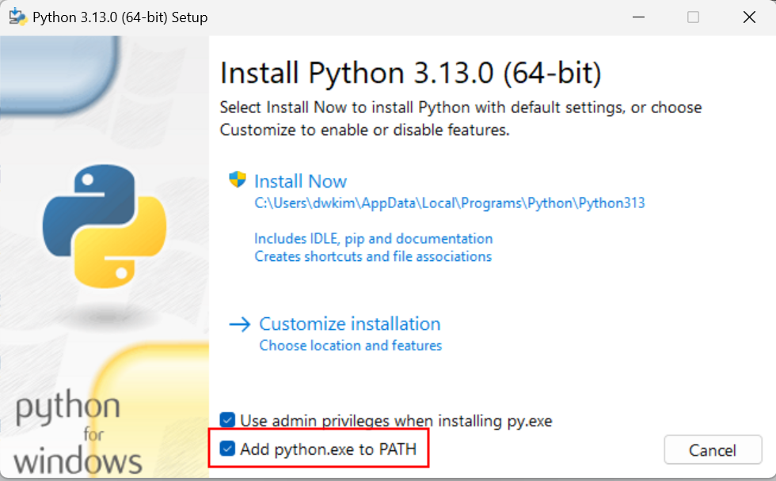
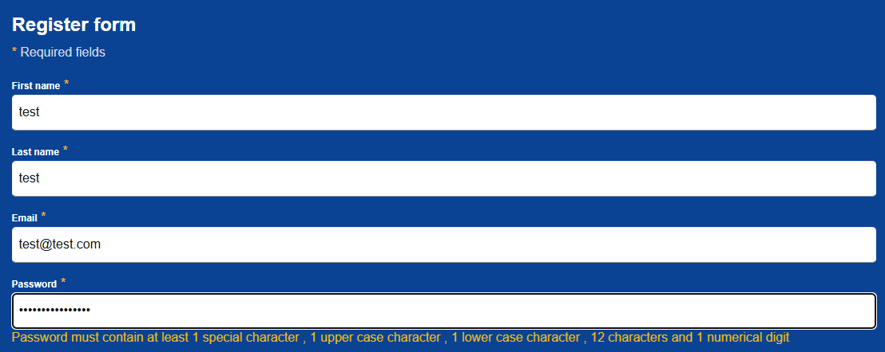
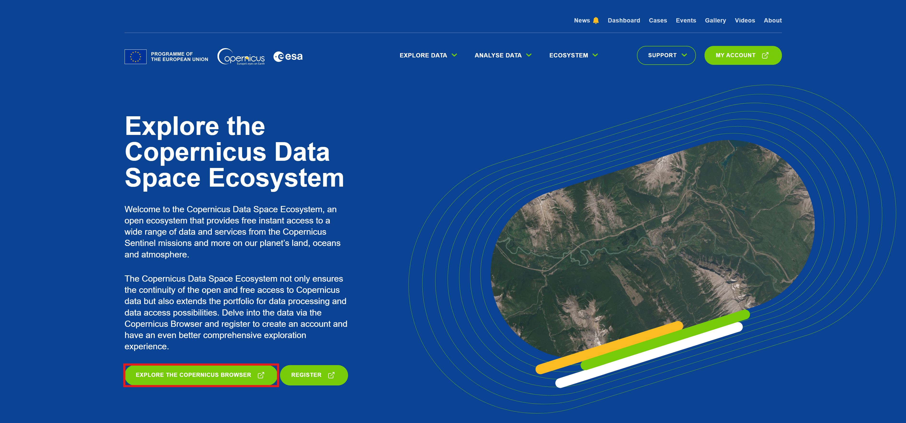
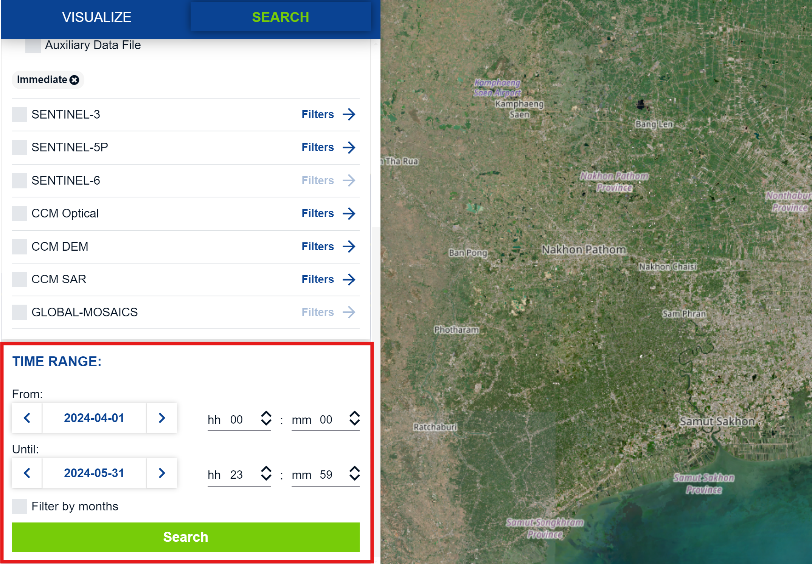
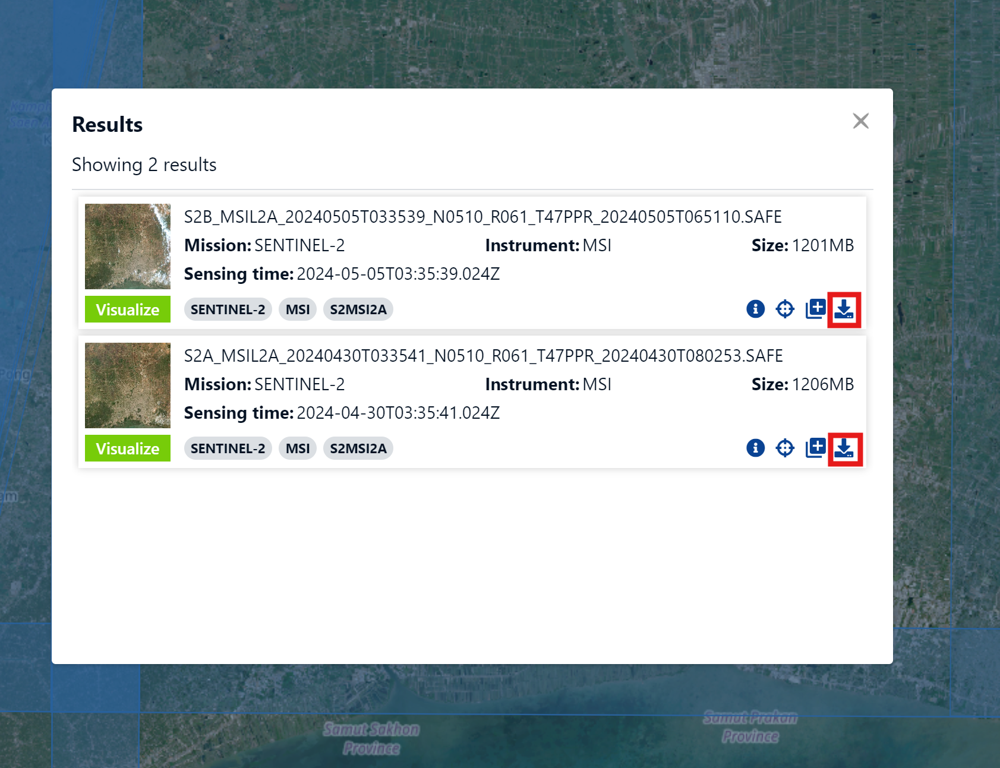
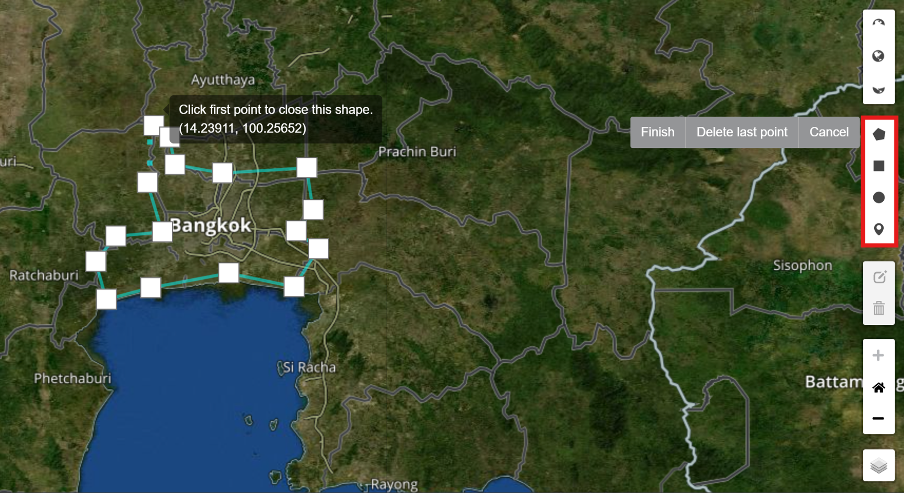
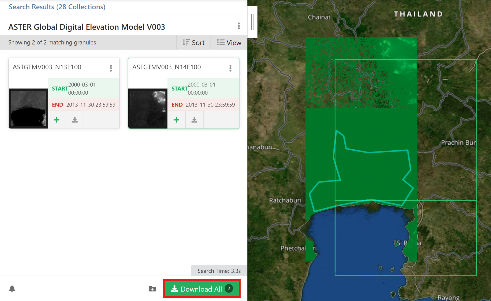

# mago3D Data Collection Guide

# :bookmark_tabs: Data Construction Approach

## ⚙️ Basic Setup

### 1. Create Practical Folder in Desired Path

Create a folder for the practical exercise.  
This folder will serve as the basic workspace for storing and managing data during the practice.  
Follow the steps below according to Windows and Mac/Linux environments.

> ### Windows
>
> 1. Run Command Prompt
>   - Search for and run cmd or Command Prompt from the Start menu.
> 2. Enter the following command to create a folder:
>    ```sh
>    C:\> mkdir mago3d
>    ```
> 3. The created folder is located at the path C:\mago3d.

> ### Mac / Linux
>
> 1. Launch Terminal
>    - Launch Terminal from Launchpad on Mac, or from the applications menu on Linux.
> 2. Enter the following command to create a folder:
>     ```sh
>     $ mkdir ~/mago3d
>    ```
> 3. The created folder is located in the home directory `~/mago3d`.

<br/>
The practical preparation is now complete. Proceed to the next step! 🚀

---
### 2. Using Docker

Download the Docker image required for the practice and run the container to set up the practice environment.  
Follow the steps below carefully.

> #### ⚠️ If Docker is not installed
>
> Most of the workshops will be executed using Docker commands.
> If Docker is not installed, it will be difficult to proceed with the practice, so please download Docker first.

<br/>

#### 1. Docker Image Download

Download the images required for the practice in advance. Enter the following commands to fetch the images locally.

```sh
docker pull gaia3d/mago-3d-tiler
docker pull gaia3d/mago-3d-terrainer
docker pull ghcr.io/osgeo/gdal:ubuntu-full-3.9.0
docker pull kartoza/geoserver
```

> #### Image Description
>
> - `gaia3d/mago-3d-tiler`: Image used for 3D tiling work in mago3D
> - `gaia3d/mago-3d-terrainer`: Image for terrain data processing
> - `kartoza/geoserver`: Image for managing and visualizing spatial data through GeoServer
> - `ghcr.io/osgeo/gdal`: Image providing spatial data processing capabilities using the GDAL library

<br/>

> #### ⚠️ If permission issues occur with GeoServer on Mac
>
> 1. Delete the existing directory and recreate the GeoServer directory.
> 2. Run the command `chmod 777 {workspace}/geoserver` to change GeoServer directory permissions.
> 3. Run the Docker image again.

<br/>

#### 2. Running Docker Container

Run the container based on the downloaded image.  
Enter the following command to run the GeoServer container.

- Windows
  ```sh
  docker run ^
    -v C:\mago3d\geoserver:/opt/geoserver/data_dir ^
    -e GEOSERVER_ADMIN_USER=admin ^
    -e GEOSERVER_ADMIN_PASSWORD=geoserver ^
    -p 8080:8080 --name geoserver kartoza/geoserver
  ```

- Mac / Linux
  ```sh
  docker run \
    -v ~/mago3d/geoserver:/opt/geoserver/data_dir \
    -e GEOSERVER_ADMIN_USER=admin \
    -e GEOSERVER_ADMIN_PASSWORD=geoserver \
    -p 8080:8080 --name geoserver kartoza/geoserver
  ```

> #### Command Explanation
>
> - `-v`: Data directory volume mount
>  - Mount the `C:\mago3d\geoserver` path to GeoServer's data_dir to store data.
> - `-e`: Environment variable settings
>  - GEOSERVER_ADMIN_USER: Admin account name `admin`
>  - GEOSERVER_ADMIN_PASSWORD: Admin account password `geoserver`
> - `-p`: Port forwarding
>  - 8080:8080: Connect host and container's 8080 ports.

<br/>

---
### 3. Verify GeoServer Access

After running the container, access [http://localhost:8080/geoserver](http://localhost:8080/geoserver) in a web browser,
which will redirect to `http://localhost:8080/geoserver/index.html`.  
If access is successful, check the GeoServer admin screen.

> - Admin account information:
>   - Username: admin
>   - Password: geoserver

<br/>

---
### 4. IDE Preparation

IDE is a software application that helps programmers develop software code efficiently.

In the last chapter of the practice, you will use an IDE to verify the results.
Visual Studio Code or IntelliJ is recommended.

If not installed, download for free from [https://code.visualstudio.com/](https://code.visualstudio.com/)

<br/>

The Docker-based practice environment is now ready! Proceed to the next step. 🎉

---
<br/>

In this practice, we will download building, transportation, satellite imagery, and DEM (Digital Elevation Model) data for urban digital twin construction.  
These data are available from platforms like Overture Maps, NASA, and Copernicus Data Space Ecosystem, all accessible as **Open Data**.

These data serve as fundamental and important materials for representing and analyzing urban spatial information three-dimensionally, utilizing various data formats such as 3D, Vector, Raster, and Terrain.

## :globe_with_meridians: Downloading Overture Maps Data

### 1. Verify Python Installation

- [Install Python](https://www.python.org/downloads/)

> #### ⚙️ Installation Checklist
>
> #### Windows
>
> - During installation, check [Add python.exe to PATH] and click [Install Now].
>   
>
> ---
> #### Mac / Linux
>
>

- Open cmd and verify Python installation. Enter the following command:
    ```sh
    python --version
    ```

### 2. Create Virtual Environment

- Navigate to the directory in the cmd where you want to create the virtual environment. To move to the directory you created earlier, enter the following command:
    ```sh
    # Windows
    cd C:\mago3d
  
    # Mac / Linux
    cd ~/mago3d
    ```

- Enter the following command to create a virtual environment:
    ```sh
    python -m venv myvenv
    ```

- Here, `myvenv` is the name of the virtual environment. You can change it to your preferred name.

### 3. Activate Virtual Environment

- To activate the virtual environment, enter the following command in the cmd:
  - Windows
    ```sh
    myvenv\Scripts\activate
    ```
  - Mac / Linux
    ```sh
    source myenv/bin/activate
    ```

- When you execute the command, the prompt will change to `(myvenv)`, indicating that the virtual environment is activated.

### 4. Install Overture Maps Package

- With the virtual environment activated, enter the following command in the cmd to install the Overture Maps package:
    ```sh
    pip install overturemaps
    ```

### 5. Download Overture Maps Data

- With the virtual environment activated, enter the following command in the cmd to download Overture Maps data:
- Download Bangkok's Building data to khlongtoei_building.geojson file
  - Windows
    ```sh
    overturemaps download ^
      --bbox=100.5507001257371797,13.6970007530963525,100.6016431134770528,13.7428667529314463 ^
      -f geojson ^
      --type=building ^
      -o khlongtoei_building.geojson
    ```
  - Mac / Linux
    ```sh
    overturemaps download \
      --bbox=100.5507001257371797,13.6970007530963525,100.6016431134770528,13.7428667529314463 \
      -f geojson \
      --type=building \
      -o khlongtoei_building.geojson
    ```

- Download Bangkok's transportation data to khlongtoei_transportation.geojson file
  - windows
    ```sh
    overturemaps download ^
      --bbox=100.5507001257371797,13.6970007530963525,100.6016431134770528,13.7428667529314463 ^
      -f geojson ^
      --type=segment ^
      -o khlongtoei_transportation.geojson
    ```    
  - Mac / Linux
    ```sh
    overturemaps download \
      --bbox=100.5507001257371797,13.6970007530963525,100.6016431134770528,13.7428667529314463 \
      -f geojson \
      --type=segment \
      -o khlongtoei_transportation.geojson
    ```

- The downloaded files will be saved in the directory `C:\mago3d` where the virtual environment was created.

<br/>

---
## :telescope: Downloading Sentinel Imagery

### 1. Access Copernicus Data Space Ecosystem

- Login is mandatory.

> #### ⚠️ Password Validity Issue During Registration
>
> 
> If you have written the password according to the regulations, you can ignore this message.

[Copernicus Data Space Ecosystem | Europe's eyes on Earth](https://dataspace.copernicus.eu/)



### 2. Set Data Search Conditions

- Move to the desired area, zoom in, click the search button, and adjust cloud coverage to 5% for SENTINEL-2>MSI>L2A.


- Specify the date and click the Search button.



### 3. Download Sentinel Data

- The list of searched images and the Sentinel image range will appear on the screen.


- Once you have searched for the desired image, click with the mouse button to download.



<br/>

---
## :rocket: Downloading NASA DEM

### 1. Access NASA EARTHDATA

- Login is mandatory.
- If necessary, install the Earthdata Download app to download TIF files.

[search.earthdata.nasa.gov](https://search.earthdata.nasa.gov/search/granules?p=C1711961296-LPCLOUD&pg[0][v]=f&pg[0][gsk]=-start_date&as[science_keywords][0]=Land%20Surface%3ATopography%3ATerrain%20Elevation%3ADigital%20Elevation/Terrain%20Model%20(Dem)&tl=1723601365!3!!&fst0=Land%20Surface&fsm0=Topography&fs10=Terrain%20Elevation&fs20=Digital%20Elevation/Terrain%20Model%20(Dem))

### 2. Specify Area

- Specify the area you want to download using the tools on the right.



### 3. Download DEM Data

- Download the data corresponding to the specified area.


