# Mago3D Data Processing Guide

# :bookmark_tabs: Data Preprocessing to be Used

Before starting the session, this chapter will proceed with data processing and conversion tasks necessary for utilizing data in mago3D and GeoServer.  
These tools provide powerful capabilities for implementing and visualizing urban digital twins, but require data conversion to formats that match each tool's characteristics and requirements.  
The data conversion work to be performed can be summarized in the following table:  

| Original Filename | Before Conversion | After Conversion |                        Reason for Conversion                        |  
|:---:|:-------:|:----------:|:-------------------------------------------------------------------:|
|khlongtoei_building.geojson| GeoJSON |  3DTiles   |       To smoothly render in mago3D according to OGC standards       |
|khlongtoei_transportation.geojson| GeoJSON | Geopackage |        To convert geojson to a suitable format for GeoServer         |
|T47PPR_20240430T033541_TCI_10m.jp2|   JP2   |  GeoTiff   |   To convert satellite imagery to a suitable format for GeoServer   |

converting the building data from Overture Maps from GeoJSON to 3D Tiles.  
convert the transportation GeoJSON into a GeoPackage format and publish it as a GeoServer layer.  
the Sentinel imagery, received in JP2 format, will be converted to GeoTIFF and also published as a GeoServer layer.  

---
## 1. Processing Overture Maps Data

Preprocessing of the received GeoJSON data is required in the Python virtual environment.
- Move all received GeoJSON files to the `C:\mago3d\workspace` folder located in the path where the virtual environment was set up.

### 1. khlongtoei_building.geojson

The building geojson file from Overture Maps has two attributes for height:  
`height` and `num_floor`(number of floors)  

Most of the data do not include height, but have information about the number of floors.
To calculate the height, multiply the number of floors by 3.3.  

If you check the following command, you'll notice the sql option.  
This allows us to process data using SQL queries.  

First, extracting height where they are not null.  
Second, extracting height where they are null and calculate height num_floors * 3.3.  
Finally, merge these two geojson files.  

- Extract building heights from khlongtoei_building.geojson file:
    - Windows
      ```sh
      docker run --rm ^
        -v C:\mago3d\workspace:/data ghcr.io/osgeo/gdal:ubuntu-full-3.9.0 ogr2ogr ^
        -f "GeoJSON" /data/khlongtoei_hegiht.geojson /data/khlongtoei_building.geojson ^
        -sql "SELECT height FROM khlongtoei_building WHERE height IS NOT NULL"
      ```
    - Mac / Linux
      ```sh
      docker run --rm \
        -v ~/mago3d/workspace:/data ghcr.io/osgeo/gdal:ubuntu-full-3.9.0 ogr2ogr \
        -f "GeoJSON" /data/khlongtoei_hegiht.geojson /data/khlongtoei_building.geojson \
        -sql "SELECT height FROM khlongtoei_building WHERE height IS NOT NULL"
      ```

- Convert building floor count to height values:
    - Windows
      ```sh
      docker run --rm ^
        -v C:\mago3d\workspace:/data ghcr.io/osgeo/gdal:ubuntu-full-3.9.0 ogr2ogr ^
        -f "GeoJSON" /data/khlongtoei_num_floors.geojson /data/khlongtoei_building.geojson ^
        -sql "SELECT num_floors * 3.3 AS height FROM khlongtoei_building WHERE height IS NULL"
      ```
    - Mac / Linux
      ```sh
      docker run --rm \
        -v ~/mago3d/workspace:/data ghcr.io/osgeo/gdal:ubuntu-full-3.9.0 ogr2ogr \
        -f "GeoJSON" /data/khlongtoei_num_floors.geojson /data/khlongtoei_building.geojson \
        -sql "SELECT num_floors * 3.3 AS height FROM khlongtoei_building WHERE height IS NULL"
      ```

- Merge the extracted building heights and floor count heights into khlongtoei_building.geojson:
    - Windows
      ```sh 
      docker run --rm ^
        -v C:\mago3d\workspace:/data ghcr.io/osgeo/gdal:ubuntu-full-3.9.0 ogr2ogr ^
        -f "GeoJSON" /data/khlongtoei_building.geojson /data/khlongtoei_hegiht.geojson
    
      docker run --rm ^
        -v C:\mago3d\workspace:/data ghcr.io/osgeo/gdal:ubuntu-full-3.9.0 ogr2ogr ^
        -f "GeoJSON" -append /data/khlongtoei_building.geojson /data/khlongtoei_num_floors.geojson
      ```
    - Mac / Linux
      ```sh 
      docker run --rm \
        -v ~/mago3d/workspace:/data ghcr.io/osgeo/gdal:ubuntu-full-3.9.0 ogr2ogr \
        -f "GeoJSON" /data/khlongtoei_building.geojson /data/khlongtoei_hegiht.geojson
    
      docker run --rm \
        -v ~/mago3d/workspace:/data ghcr.io/osgeo/gdal:ubuntu-full-3.9.0 ogr2ogr \
        -f "GeoJSON" -append /data/khlongtoei_building.geojson /data/khlongtoei_num_floors.geojson
      ```

- Create an `input` folder in the `C:\mago3d\workspace` path and place the merged khlongtoei_building.geojson file inside.

If both height and floor count are missing, the `-mh` options(minimumHeight) in `mago-3d-tiler` can help.  
This option sat a default height for extrusion when the height column is empty.  

### 2. khlongtoei_transportation.geojson

This file will be converted to Geopackage to upload as a layer to GeoServer.

- Windows
  ```sh
  docker run --rm ^
    -v C:\mago3d\workspace:/data ghcr.io/osgeo/gdal:ubuntu-full-3.9.0 ogr2ogr ^
    -f "GPKG" /data/khlongtoei_transportation.gpkg /data/khlongtoei_transportation.geojson
  ```
- Mac / Linux
  ```sh
  docker run --rm \
    -v ~/mago3d/workspace:/data ghcr.io/osgeo/gdal:ubuntu-full-3.9.0 ogr2ogr \
    -f "GPKG" /data/khlongtoei_transportation.gpkg /data/khlongtoei_transportation.geojson
  ```
- Create a `data` folder in the `C:\mago3d\workspace\geoserver` path and place the converted gpkg file inside.

<br/>

---
## 2. Processing Copernicus Data Space Ecosystem Data

To upload to GeoServer as a layer, this file will be converted to GeoTIFF.

- Unzip the downloaded SAFE.zip file.
- Move the `T47PPR_20240430T033541_TCI_10m.jp2` file from the `GRANULE\L2A_T47PPR_A046247_20240430T034959\IMG_DATA\R10m` path to the `C:\mago3d\workspace` folder.
- Convert the jp2 file to tif:
    - Windows
        ```sh
        docker run --rm ^
          -v C:\mago3d\workspace:/data ghcr.io/osgeo/gdal:ubuntu-full-3.9.0 gdal_translate ^
          -of GTiff /data/T47PPR_20240430T033541_TCI_10m.jp2 /data/T47PPR_20240430T033541_TCI_10m.tif
        ```
    - Mac / Linux
        ```sh
        docker run --rm \
          -v ~/mago3d/workspace:/data ghcr.io/osgeo/gdal:ubuntu-full-3.9.0 gdal_translate \
          -of GTiff /data/T47PPR_20240430T033541_TCI_10m.jp2 /data/T47PPR_20240430T033541_TCI_10m.tif
        ```
- Place the converted tif file in the `C:\mago3d\workspace\geoserver\data` path.

---
## 3. Processing NASA DEM Data

This file will be converted to terrain information through mago3d-terrainer and will also be used when running mago3d-tiler.

- Open the downloaded `ASTGTM_003-20241118_054943` folder and copy the `ASTGTMV003_N13E100_dem.tif` file.
- Create a `dem` folder in the `C:\mago3d\workspace` path and paste the copied file.

<br/>

Data processing is now complete. Proceed to the next step! 🚀

---
# 🌟 mago3D Usage Guide

The `mago3DTiler` converts preprocessed building GeoJSON and DEM files into 3D buildings on the terrain.  
For more information, visit the [mago3DTiler Github](http://github.com/Gaia3D/mago-3d-tiler)

- Verify that the data is correctly placed in the `input` and `dem` folders in the `C:\mago3d\workspace` path.
    - input> khlongtoei_building.geojson
    - dem> ASTGTMV003_N13E100_dem.tif

## mago3DTiler

Run mago3d-tiler with the default building height set to 3.3m.  
Depending on computer specifications and network, it may take a minimum of 7 minutes.

- Windows
    ```sh
    docker run ^
      --rm ^
      -v C:\mago3d\workspace:/workspace gaia3d/mago-3d-tiler ^
      -input /workspace/input ^
      -output /workspace/output ^
      -it geojson ^
      -crs 4326 ^
      -te /workspace/dem/ASTGTMV003_N13E100_dem.tif ^
      -mh 3.3 ^
      -hc height
    ```

- Mac / Linux
    ```sh
    docker run \
      --rm \
      -v ~/mago3d/workspace:/workspace gaia3d/mago-3d-tiler \
      -input /workspace/input \
      -output /workspace/output \
      -it geojson \
      -crs 4326 \
      -te /workspace/dem/ASTGTMV003_N13E100_dem.tif \
      -mh 3.3 \
      -hc height
    ```
  
<br/>

`docker run --rm -v`: The standard Docker command to run a container with volume mounting.  

> ### Command Explanation
>
> Enter `docker run gaia3d/mago-3d-tiler --help` to see all command options.
>
> - `-output`: Path to store post-conversion materials
> - `-it` (`--inputType`): Data type of pre-conversion materials
> - `-crs`: EPSG coordinate system of pre-conversion materials
> - `-te` (`--terrain`): Path to GeoTiff format Terrain file used for conversion
> - `-mh` (`--minimumHeight`): Set minimum height value for 3D models
> - `-hc` (`--heightColumn`): Set column containing height values for 3D models

<br/>

> ### 3DTiles
>
> 3D Tiles is an open standard developed by Cesium for efficiently streaming and rendering massive heterogeneous 3D geospatial datasets.
> It enables dynamic visualization of models such as buildings, terrain, photogrammetry, point clouds, and vector data by organizing them into a spatially and hierarchically structured format.
> This allows seamless level-of-detail management and optimal performance for web and desktop applications, making it a core technology for digital twins, urban planning, and geospatial analysis.

Once the data conversion is complete, you’ll find a `data` folder and a `tileset.json` file in the output directory.  
These are your 3D Tiles, ready to use.  

Enjoy working with `mago-3d-tiler`, and remember, your feedback and contributions help us keep improving! 😊

---
## mago3DTerrainer

It converts DEM files into the Quantized Mesh Terrain format, supporting multiple DEM files, even with varying resolutions or overlapping areas.  
It also provides excellent mesh optimization.  

Run mago3d-terrainer with the maximum terrain depth set to 14.  
Depending on computer specifications and network, it may take a minimum of 10 minutes.  

- Windows
    ```sh
    docker run ^
      --rm ^
      -v C:\mago3d\workspace:/workspace gaia3d/mago-3d-terrainer ^
      -input /workspace/dem ^
      -output /workspace/assets/terrain ^
      -cn ^
      -it bilinear ^
      -mn 0 ^
      -mx 14
    ```

- Mac / Linux
    ```sh
    docker run \
      --rm \
      -v ~/mago3d/workspace:/workspace gaia3d/mago-3d-terrainer \
      -input /workspace/dem \
      -output /workspace/assets/terrain \
      -cn \
      -it bilinear \
      -mn 0 \
      -mx 14
    ```
  
<br/>

### Command Explanation
`docker run --rm -v`: The standard Docker command to run a container with volume mounting.

Enter `docker run gaia3d/mago-3d-terrainer --help` to see all command options.
> - `-input`: Path containing pre-conversion materials
> - `-output`: Path to store post-conversion materials
> - `-cn` (`--calculateNormals`): Automatically calculate normal vectors
>   - Normal vectors represent the direction perpendicular to a specific point on the surface of a 3D object.
> - `-it` (`--interpolationType`): Set interpolation method
>   - Two values can be used for this option: Nearest and Bilinear.
>     - Nearest: Uses nearest neighbor interpolation to select the closest neighbor value when converting data.
>     - Bilinear: Uses bilinear interpolation to calculate values based on four points.
> - `-mn` (`--minDepth`): Set minimum tile depth
> - `-mx` (`--maxDepth`): Set maximum tile depth

For this exercise, we’ll limit the levels from 0 to 14.  
After conversion, the output directory will contain folders labeled from `0 to 14` and a `layer.json` file.  

Since Bangkok is mostly flat, the terrain might not look very dramatic, but it’s still essential for integrating with the 3D Tiles.  

This concludes the core part of the workshop: creating 3D Tiles and terrain.  
While the conversion runs, let’s move on to the next exercise.  

If you have any questions about the process, feel free to ask! 😊  

---
# 🗺️ GeoServer Usage Guide

## 1. Verify GeoServer Data Directory

- Navigate to `C:\mago3d\workspace\geoserver\data` path and confirm that data is correctly placed.
    - data > khlongtoei_transportation.gpkg, T47PPR_20240430T033541_TCI_10m.tif

The sample code already includes the workspace and layer name for GeoServer.  
It’s recommended to stick to the guide and use the same names to avoid confusion.

## 2. Create Workspace

1. Access GeoServer
    - Open [http://localhost:8080/geoserver] in your browser
    - Login: Use the options set during image execution
    - **ID**: admin
    - **PASSWORD**: geoserver

   

2. Navigate to **Workspaces** in the left menu

   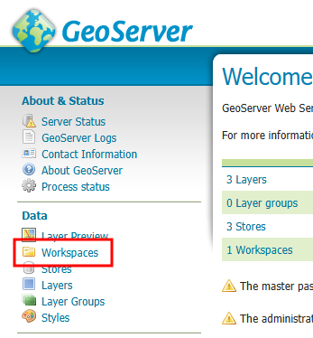

3. Click **Add new workspace** button

   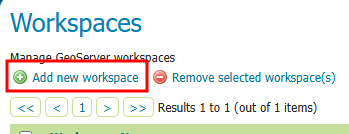

4. Enter the following information:
    - **Name**: Workspace name (e.g., `mago3d`)
    - **Namespace URI**: Unique URI (e.g., `http://www.mago3d_workspace.com`)

   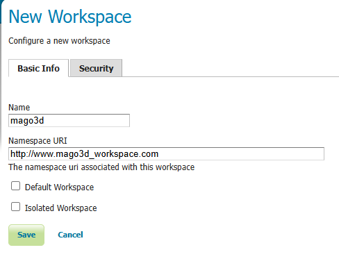

5. Click **Save** button to save.

<br/>

## 3. Create Stores

1. Go to **Data Stores** in the admin console

   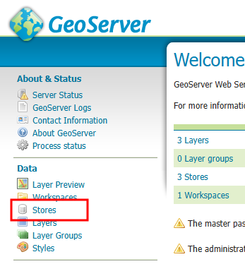

2. Click **Add new store** button

   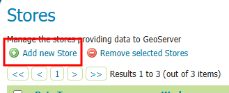

3. Select the data format you want to use (e.g., GeoTIFF, GeoPackage)

   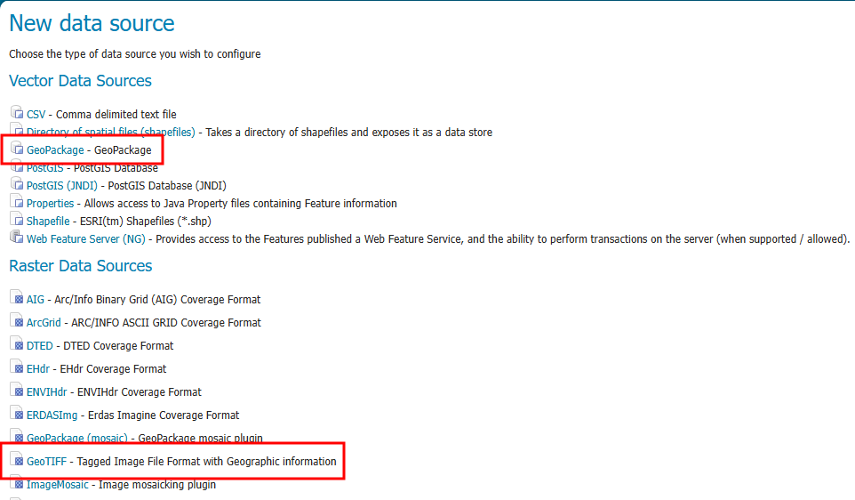

4. Enter the following information:
    - **Workspace**: Select the workspace created previously
    - **Data Store Name**: Enter a name for the data store (e.g., `sentinel`, `transportation`)
    - **Connection Parameters**: Click Browse to select the directory where data was previously stored

   #### How to Register Sentinel GeoTiFF

   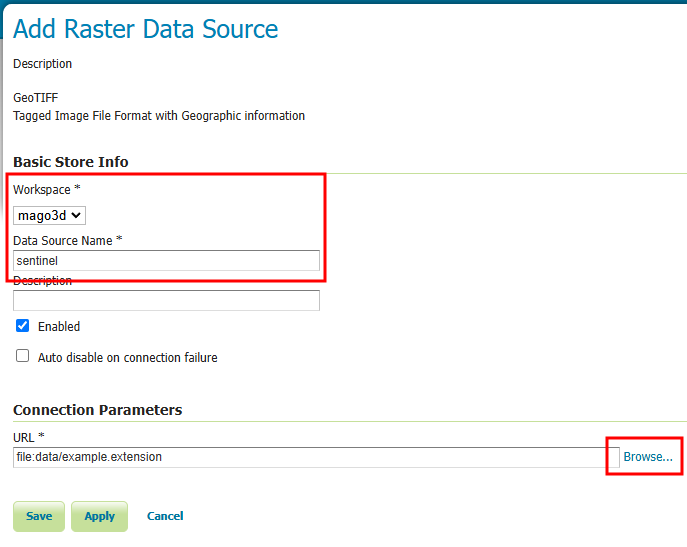
   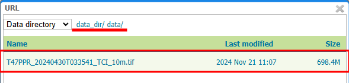

   ### How to Register Transportation GeoPackage

   
   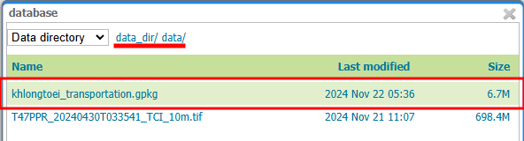

5. Click **Save** button to save.

<br/>

## 4. Publish Layers

1. Go to the **Layers** menu

   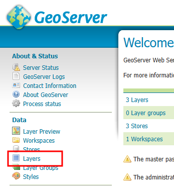

2. Click **Add new layer** button

   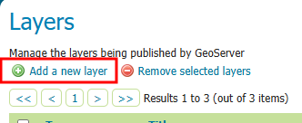

3. Select the data store created in the previous step

4. Select the data you want to add from the available data list and click **Publish**

   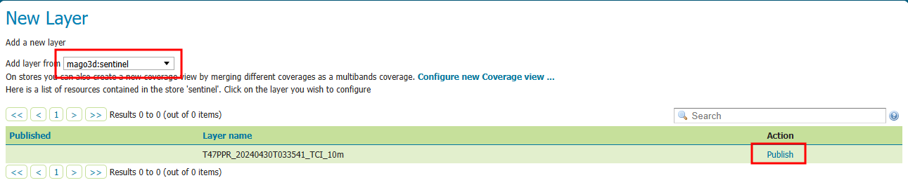

5. Set layer attributes:
    - **Name**: Layer name (e.g., `sentinel`, `transportation`)

   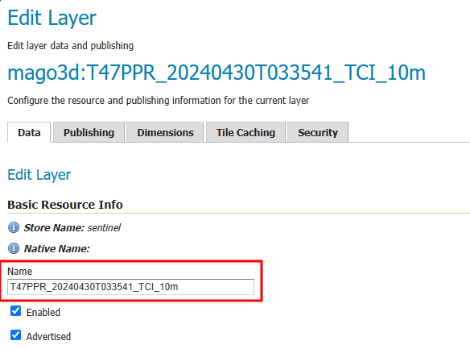

    - **Spatial Reference System**: Specify the coordinate system of the data (e.g., EPSG:4326)

    - **Layer Bounding Box**: Click "Compute from data" to apply

   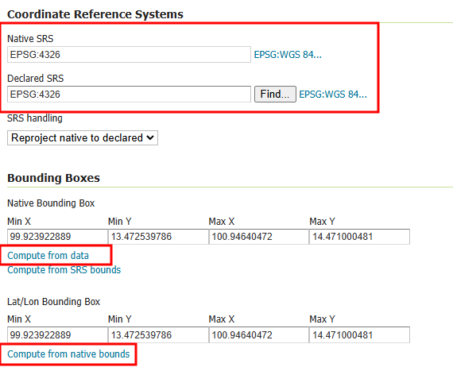

6. Click **Save** button to save.

<br/>

## 5. Layer Preview

1. Go to the **Layer Preview** menu

   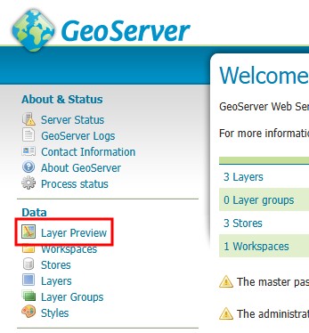

2. Find the published layer in the list (e.g., `sentinel`)

3. Select a preview format (WMS, OpenLayers, etc.)
    - Selecting OpenLayers allows you to view the layer in the browser

   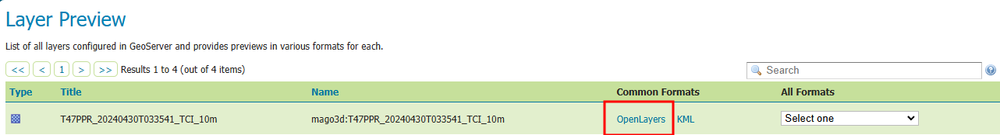
   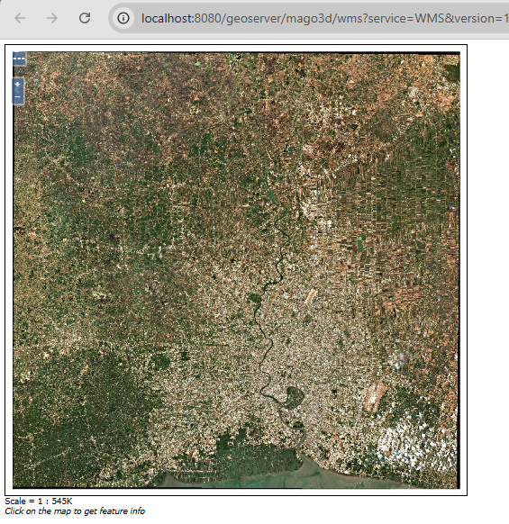

<br/>

So far, we’ve been publishing layers in GeoServer.  
GeoServer is an open-source geographic server designed to serve 2D geospatial data using OGC standards.
In the next session, we’ll explore **WMS** (Web Map Service), a standard web interface, to access and visualize these published layers.
This will allow us to integrate and display the layers in various GIS platforms or web applications seamlessly.  

In this session, we’ve focused on converting data into formats that can be visualized on a web page.  
The building GeoJSON and DEM were converted into 3D Tiles, while the DEM was used to create Quantized-Mesh Terrain.  
We also published transportation and satellite image layers in GeoServer, making them ready to serve via WMS.  

All tasks are now complete. Let's check the results! 🚀

<br/>

---