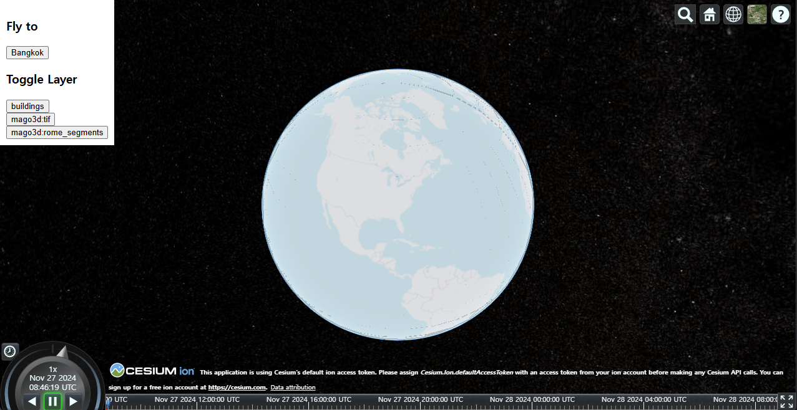
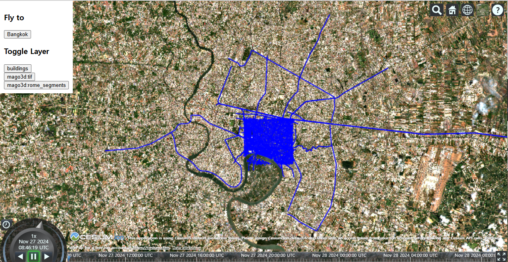
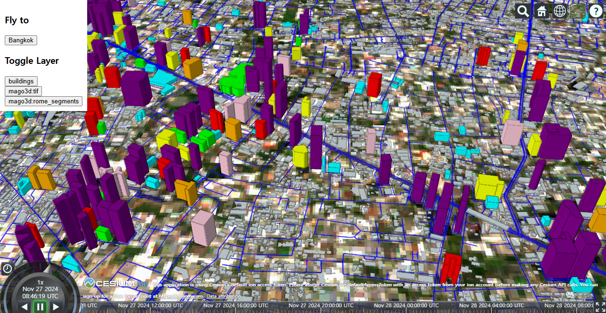

# 💻 Confirming Results Using Sample Code

- Open the `C:\mago3d\workspace\index.html` file in your preferred IDE
    - If necessary, modify the codes with ✏️ icons to suit your environment
- Keep the index.html file open and activate the server to view results in Chrome

## Sample Code

---

### Loading the CesiumJS library
```html
<script src="https://cesium.com/downloads/cesiumjs/releases/1.121/Build/Cesium/Cesium.js"></script>
<link href="https://cesium.com/downloads/cesiumjs/releases/1.121/Build/Cesium/Widgets/widgets.css" rel="stylesheet">
```
CesiumJS is an open-source JavaScript library for 3D globe and map visualization.  
`Cesium.js`: Cesium is used in JavaScript code for rendering maps and 3D globes.  
`widgets.css`: This is a CSS file that provides the default UI component styles for Cesium.  

---

### HTML code
```html
    <div id="cesiumContainer"></div>
    <div id="function-div">
        <h3>Fly to</h3>
        <button id="bangkok-btn">Bangkok</button>

        <h3>Toggle Layer</h3>
        <button id="buildings-btn">buildings</button>
        <div id="layerButtons"></div>
    </div>
```
`<div id="cesiumContainer"></div>`: This is the space where Cesium will render the 3D globe. A 3D view will be created in this div using Cesium.Viewer in the JavaScript code.
```html
<div id="function-div">
    <h3>Fly to</h3>
    <button id="bangkok-btn">Bangkok</button>

    <h3>Toggle Layer</h3>
    <button id="buildings-btn">buildings</button>
    <div id="layerButtons"></div>
</div>
```
This is a UI panel containing buttons that allow users to interact with specific features, such as camera movement and layer switching.

---

### Javascript code
#### 1. Cesium Viewer Initialization
```javascript
const viewer = new Cesium.Viewer('cesiumContainer');
viewer.scene.globe.depthTestAgainstTerrain = true; // Ensures proper depth testing for 3D objects against terrain.
viewer.scene.requestRenderMode = true; // Optimizes rendering performance by only rendering on scene changes.
```
* Initializes the Cesium Viewer, rendering the 3D globe within the cesiumContainer div.
* Configures depth testing and rendering optimizations for better performance.

---

#### 2. Resource Configuration
```javascript
const resource_3d = './output/tileset.json'; // Path to the 3D tileset resource.
const resource_terrain = './assets/terrain/'; // Path to terrain data.
const geoserverUrl = 'http://localhost:8080/geoserver/wms'; // URL for GeoServer WMS service.
const resource_2d = 'mago3d:sentinel'; // GeoServer layer for 2D imagery.
const resource_transportation = 'mago3d:transportation'; // GeoServer layer for transportation data.
```
Defines file paths and GeoServer URLs used for terrain, 3D tiles, and 2D imagery layers.

---

#### 3. Terrain Setup
```javascript
viewer.terrainProvider = await Cesium.CesiumTerrainProvider.fromUrl(resource_terrain);
```
Configures the Cesium Viewer to use terrain data from the specified path.

---

#### 4. 3D Tileset Setup
```javascript
const tileset = await Cesium.Cesium3DTileset.fromUrl(resource_3d);
viewer.scene.primitives.add(tileset);
```
Loads a 3D tileset (e.g., buildings or other structures) and adds it to the scene.

---

#### 5. Base Imagery Setup
```javascript
viewer.scene.imageryLayers.removeAll(); // Removes any default imagery layers.
const osm = new Cesium.OpenStreetMapImageryProvider({
    url: 'https://a.tile.openstreetmap.org/'
});
viewer.scene.imageryLayers.addImageryProvider(osm);
```
Sets the base map imagery to OpenStreetMap tiles.

---

#### 6. Adding Layers from GeoServer
```javascript
const layers = {};
const addLayer = (layerName) => {
    const layer = new Cesium.ImageryLayer(
        new Cesium.WebMapServiceImageryProvider({
            url: geoserverUrl,
            layers: layerName,
            minimumLevel: 0,
            parameters: {
                service: "WMS",
                version: "1.1.1",
                request: "GetMap",
                transparent: "true",
                format: "image/png",
                tiled: true
            }
        })
    );
    viewer.scene.imageryLayers.add(layer);
    layers[layerName] = layer;
};
addLayer(resource_2d);
addLayer(resource_transportation);
```
Dynamically adds GeoServer WMS layers (e.g., satellite imagery, transportation data) to the Cesium Viewer.

---

#### 7. Post-Render Listener for Styling
```javascript
const removeListener = viewer.scene.postRender.addEventListener(
    function () {
        if (viewer.scene.globe.tilesLoaded) {
            setStyle(); // Apply styles after tiles are fully loaded.
            removeListener(); // Remove the listener once done.
        }
    }.bind(this)
);
```
Ensures styling is applied after terrain and tiles are loaded.

---

#### 8. Fly-to Functionality
```javascript
const bangkok = { lat: 13.730276, lng: 100.560534 };
const bangkokBtn = document.getElementById("bangkok-btn");

const flyToPosition = (viewer, position) => {
    const alt = 50000;
    viewer.camera.flyTo({
        destination: Cesium.Cartesian3.fromDegrees(position.lng, position.lat, alt)
    });
};
bangkokBtn.addEventListener("click", () => flyToPosition(viewer, bangkok));
```
Defines a function to move the camera to a specific position (e.g., Bangkok) when the button is clicked.

---

#### 9. Toggle 3D Buildings / Toggle GeoServer Layers
```javascript
const buildingsBtn = document.getElementById("buildings-btn");

const toggleBuildings = () => {
    tileset.show = !tileset.show; // Toggles the visibility of the 3D tileset.
    buildingsBtn.style.color = buildingsBtn.style.color === 'gray' ? '' : 'gray'; // Updates button color.
};
buildingsBtn.addEventListener("click", toggleBuildings);
```
Toggles the visibility of the 3D tileset (e.g., buildings) and updates the button's color to indicate its state.

```javascript
const layerButtonsContainer = document.getElementById('layerButtons');
const layerNames = [resource_2d, resource_transportation];

const toggleLayer = (layerName, button) => {
    if (layers[layerName]) {
        layers[layerName].show = !layers[layerName].show; // Toggles layer visibility.
    }
    button.style.color = button.style.color === 'gray' ? '' : 'gray'; // Updates button color.
};

layerNames.forEach(layerName => {
    const button = document.createElement('button');
    button.textContent = layerName; // Button text is the layer name.
    button.onclick = () => toggleLayer(layerName, button);
    layerButtonsContainer.appendChild(button);
});
```
Dynamically generates buttons to toggle the visibility of GeoServer layers.

---

#### 10. Apply 3D Tile Styling
```javascript
const setStyle = () => {
    tileset.style = new Cesium.Cesium3DTileStyle({
        defines: {
            Height: "Number(${height})" // Define height attribute for styling.
        },
        color: {
            conditions: [
                ["${Height} >= 100", "color('purple')"],
                ["${Height} >= 95", "color('pink')"],
                ["${Height} >= 80", "color('red')"],
                ["${Height} >= 70", "color('orange')"],
                ["${Height} >= 45", "color('yellow')"],
                ["${Height} >= 27", "color('lime')"],
                ["${Height} >= 7", "color('cyan')"],
                ["${Height} >= 1", "color('white')"],
                ["true", "color('lightgray')"]
            ]
        }
    });
};
```
Applies a dynamic style to the 3D tileset based on the height attribute, coloring features according to their elevation.

---

## IDE

### 1. Visual Studio Code


### 2. Intellij


## Results

- Initial screen after accessing:

  

- Press the **[Bangkok]** button in the top left to view Bangkok's landscape

  

- Click the Toggle Layer button to control layer display

- Zoom in to see the well-rendered results of your work

  

<br/>

> ### ⚠️ If the screen keeps auto-refreshing
>
> If your graphics card or RAM memory is insufficient, Cesium will automatically reboot the page

<br/>

---

## 🎉 Congratulations! 🎉