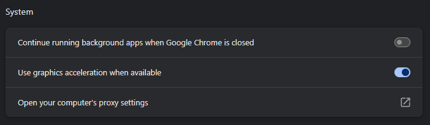
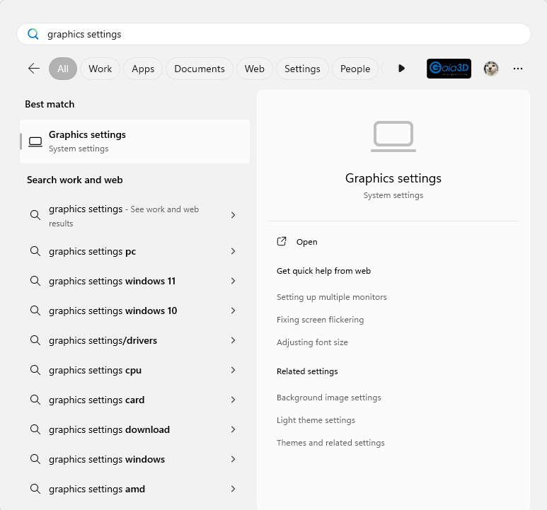
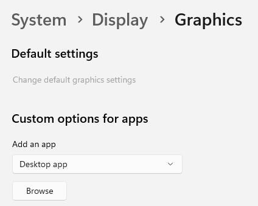
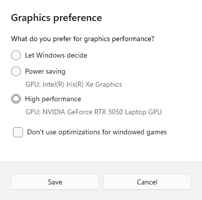
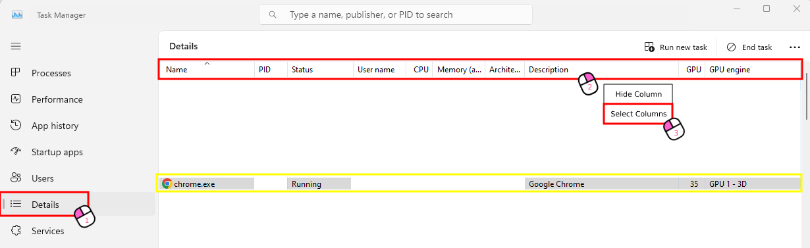
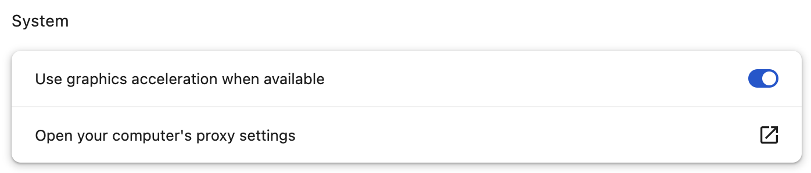
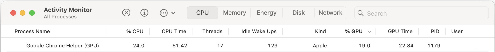
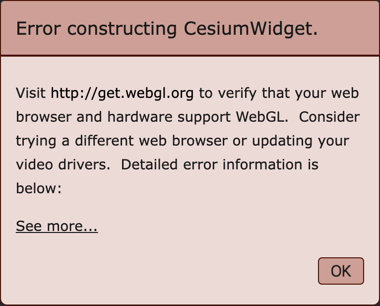

# Google Hardware Acceleration Settings

Now we’re at the most important exercise!  

For those of you using laptops, many web browsers don’t use the GPU for rendering 3D graphics by default.  
Without GPU acceleration, performance can be slower, especially for complex visualizations.  
In this session, we’ll guide you through enabling 3D graphics acceleration in your web browser, 
ensuring smoother rendering and better performance.  

Let’s get started!  

## WINDOWS (ver.11)

### 1. Chrome Settings

- Enter the following code in the Chrome address bar:
    ```
    chrome://settings/system
    ```
- Check [**Use graphics acceleration when available**].

  

### 2. Graphics Settings

- Search for [**Graphics Settings**] in the WINDOWS search bar.

  

- Click [**Browse**] under App Addition.

  

- Find the download path for Chrome and select [**chrome.exe**].

  
  

- Click on the added Google Chrome and select [**Options**].
- Check [**High Performance**] for graphics default settings and save.

  

### 3. Task Manager

- Click the [**Details**] tab on the left.
- Right-click on the top header tab and select [**Select Columns**].
- Scroll down and check [**GPU, GPU Engine**] then click OK.

  


## MAC OS

### 1. Chrome settings

- Enter the following code in the Chrome address bar:
    ```
    chrome://settings/system
    ```
- Check [**Use graphics acceleration when available**].

  

### 2. Checking Active Status

- Mac OS does not require any additional graphics settings.

- Click the [**CPU**] tab at the top.
- Click [**%GPU**] to sort in descending order.
- Check for Chrome Window Helper (GPU).



### ⚠️ If Chrome's hardware acceleration is not enabled on macOS

- WebGL, required by Cesium, will not function properly, causing errors.

  

---

## Conclusion

Let’s take a moment to wrap up this workshop.  

In this workshop, we practiced building a digital twin of a city.  
- open data
- open source
- use OGC standard
(Quantized Mesh is not an OGC standard.)  

We successfully visualized foundational data for a city’s digital twin in a web browser--**without any additional costs.**  
Based on what you’ve learned today, why not try creating a digital twin of your own city?

---