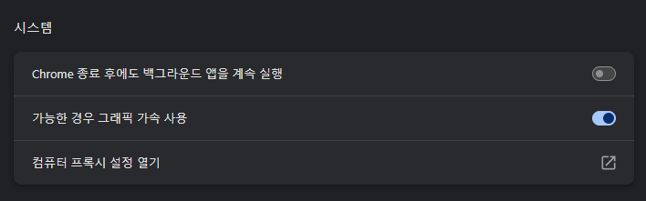
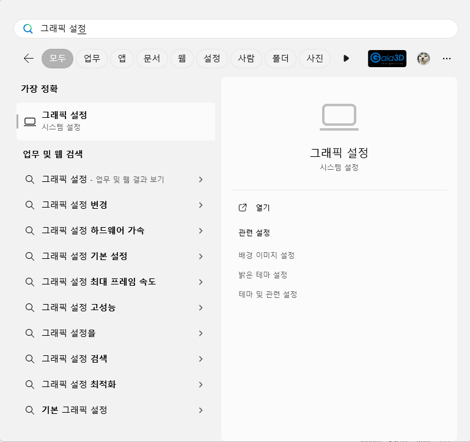
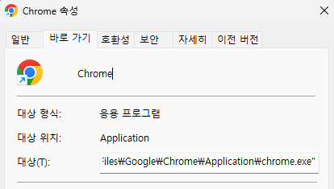
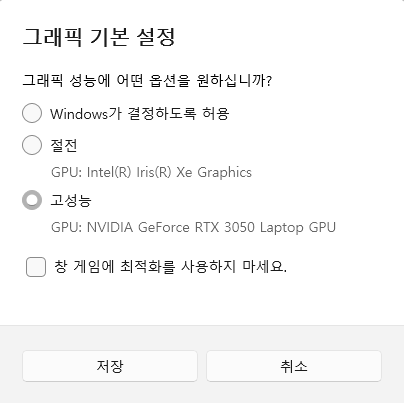

# Google 하드웨어 가속 설정

## WINDOW (ver.11)

### 1. Chrome 설정 

- Chrome 주소창에 아래의 코드를 입력합니다.
    ```
    chrome://settings/system
    ```
- [**가능한 경우 그래픽 가속 사용**]을 체크합니다.

  

### 2. 그래픽 설정

- WINDOW 검색 창에 [**그래픽 설정**]을 검색합니다.

  

- 앱 추가의 [**찾아보기**]를 클릭합니다.

  

- chrome을 다운받은 경로를 찾아 [**chrome.exe**]를 선택합니다.

  
  

- 추가된 Google Chrome을 클릭하여 [**옵션**]을 클릭합니다.
- 그래픽 기본 설정을 [**고성능**]으로 체크한 후 저장합니다.

  

### 3. 작업 관리자

- 왼쪽 [**자세히**] 탭을 클릭합니다.
- 상단 헤더 탭을 우클릭한 후 [**열선택**]을 클릭합니다.
- 스크롤을 내려 [**GPU, GPU 엔진**] 체크 후 확인을 누릅니다.

  


## MAC OS

### 1. Chrome 설정

- Chrome 주소창에 아래의 코드를 입력합니다.
  ```
    chrome://settings/system
  ```

- [**가능한 경우 그래픽 가속 사용**]을 체크합니다.

  

### 2. 활성 상태 보기

- Mac 에서는 별도의 그래픽 설정이 필요 없습니다.

- 상단의 [**CPU**] 탭을 클릭합니다.
- [**%GPU**] 를 클릭하여 내림차순으로 정렬합니다.
- Chrome Window Helper (GPU) 를 확인합니다.


### ⚠️ mac에서 Chrome 그래픽 가속을 설정하지 않는 경우

- cesium에 필요한 WebGl이 동작하지 않아서 오류 발생


