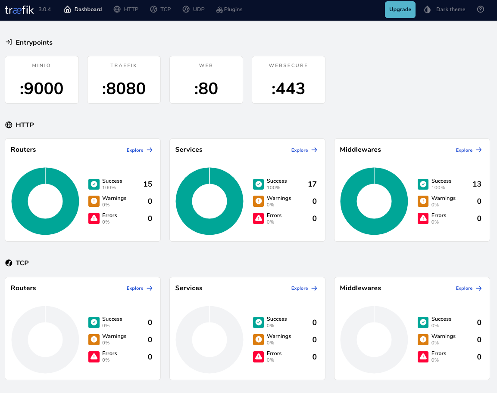
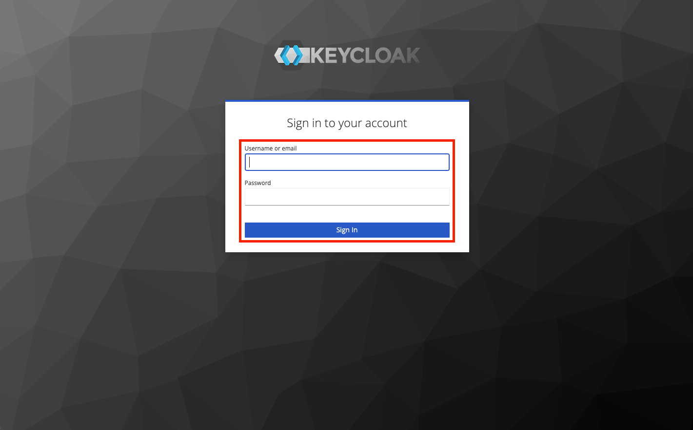
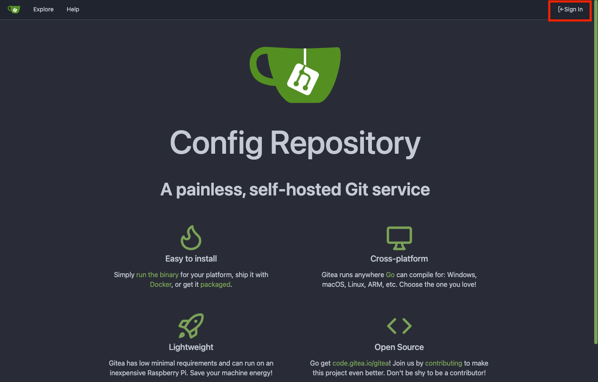
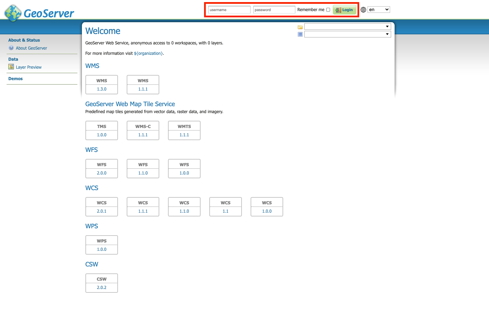
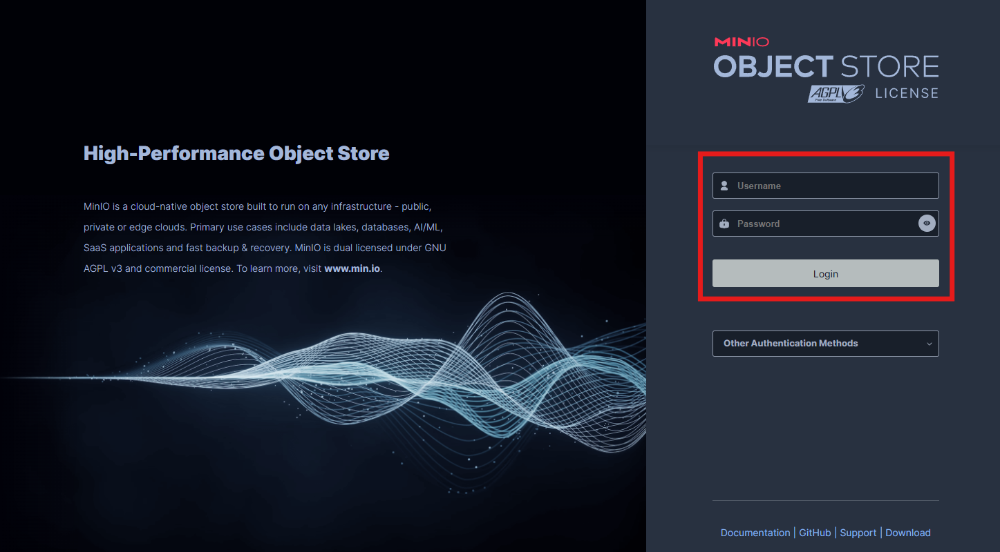
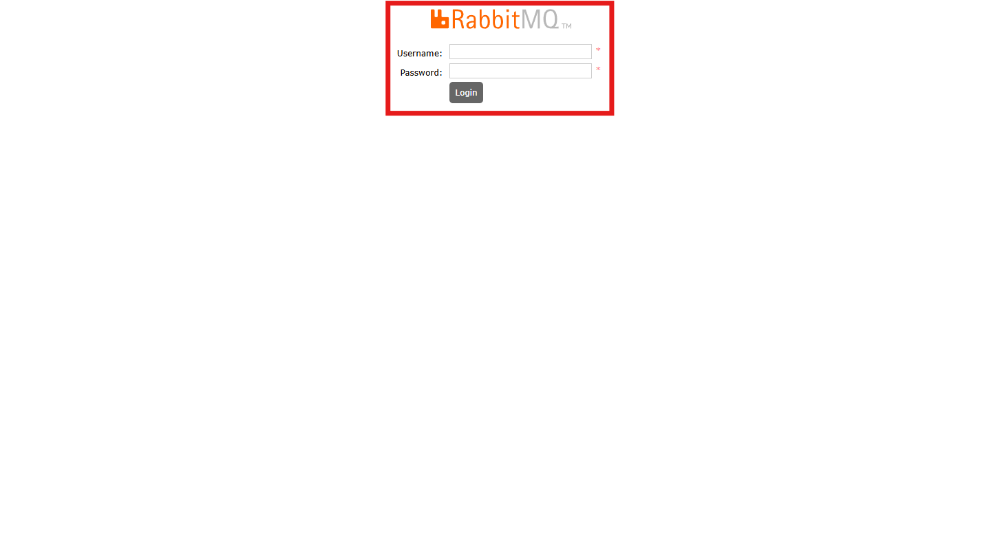
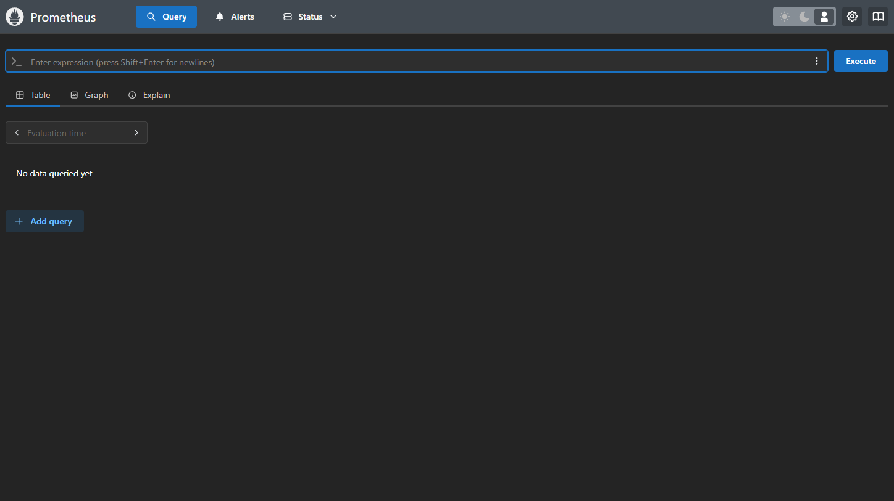
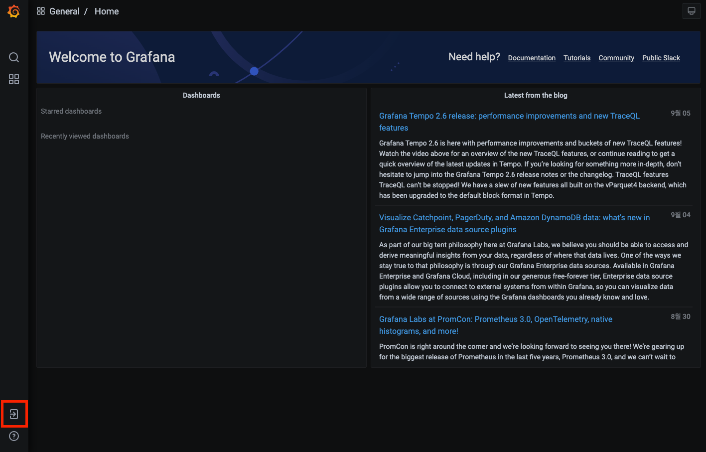
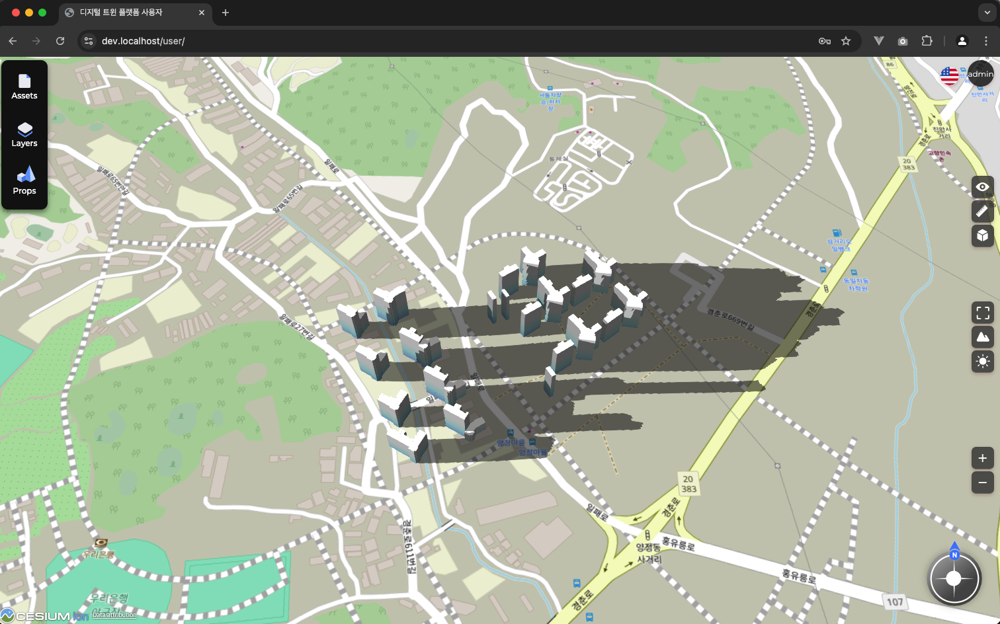
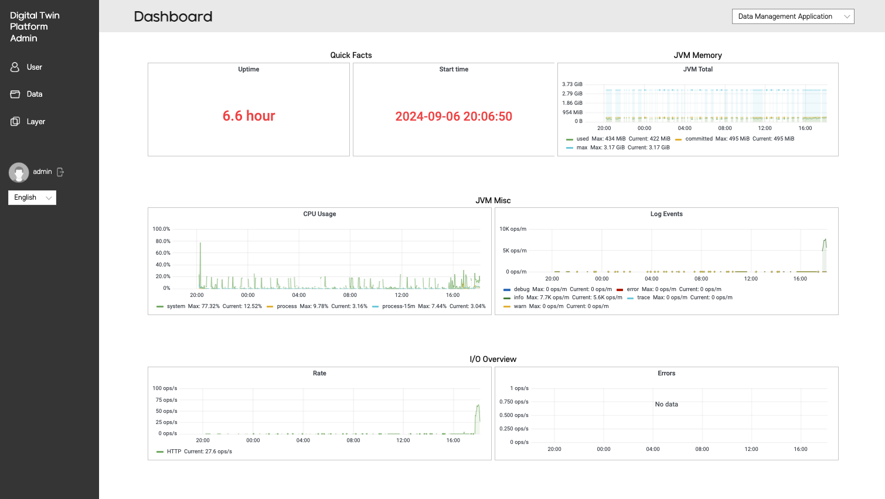

# mago3D Installation Guide

---

This document provides instructions on how to install mago3D using Docker Compose.

## Prerequisites
* An environment with Docker installed
* An environment with a localhost certificate installed

Start the Docker daemon.
For Windows, launch Docker Desktop.
For Mac, launch Docker Desktop.
For Linux, start the Docker service.

### How to Install Certificate
Generate a localhost certificate using [mkcert](https://github.com/FiloSottile/mkcert)

* winget(Windows)    
  Run the following command in an elevated PowerShell terminal (as an administrator).
  ```powershell
  winget install mkcert
  ```
* brew(macOS)
  ```bash
  brew install mkcert
  ```

* Install the local CA
  ```cmd
  mkcert -install
  ```
* Generate the certificate
  ```cmd
  cd install/traefik/certs
  ```
  ```cmd
    mkcert -cert-file default.crt -key-file default.key localhost dev.localhost *.localhost
  ```

If a certificate is installed on the server
Copy the certificate and place it in the `install/traefik/certs` path.


## 2. Create Docker Network
Run the following command to create the Docker Network.
```bash
docker network create mago3d
```

## 3. Deploy using Docker Compose

```bash
cd install
./compose.sh up -d
```
If you don't have execution permissions, run the following command
```bash
chmod +x *.sh
./compose.sh up -d
```

If you want to stop it, run the following command.
```bash
./compose.sh down
```

### 4. Check Access
* https://dev.localhost/dashboard/  
  

* https://dev.localhost/auth/  
  
* Account: admin/keycloak

* https://dev.localhost/configrepo/  
  
* Account: git/git

* https://dev.localhost/geoserver/  
  
* Account: admin/geoserver

* https://dev.localhost/minio/console/login  
  
* Account: minioadmin/minioadmin

* https://dev.localhost/rabbitmq/  
  
* Account: admin/admin

* https://dev.localhost/prometheus/query  
  

* https://dev.localhost/grafana/   
  
* Account: admin/admin

* https://dev.localhost/user  
* Account: admin/admin
* After logging in, access the user page
  

* https://dev.localhost/admin  
* Account: admin/admin
* After logging in, access the admin page
  
